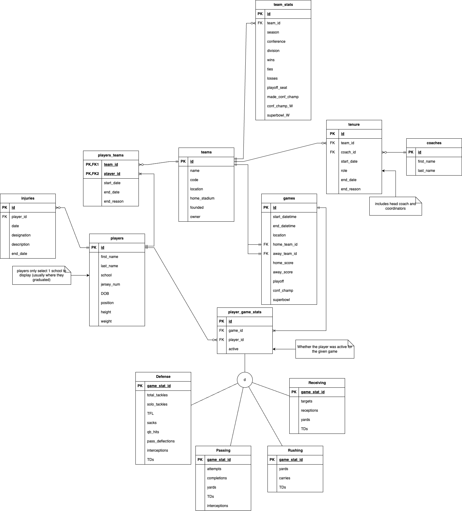

# Design Document

By ADAM SELIVANOV

Video overview: <https://youtu.be/gmD5d4uc8c8>

## Scope

The database is designed to represent and track various aspects of the National Football League (NFL), including teams, players, coaches, games, statistics, and related historical and current data.

Within Scope: 
    Players, Coaches, Teams, Stadiums (associated with teams), Games, Player and Team statistics Injuries, Player affiliations to Teams, Coach affiliations to Teams.

Outside Scope:
    Fans, other staff members, Training facilities, Team offices, Merchandise, TV ratings, Contracts Sponsorships.

## Functional Requirements

Functions:

- Track players, their affiliations to teams, and their performance metrics.
- Monitor team statistics, achievements, and affiliations with coaches.
- Record game results, including scores, dates, and participating teams.
- Manage injury data, including the nature of the injury and recovery status.
- View statistics on a per-game, per-season, or career basis.
- Register the tenure of coaches with teams.

Beyond scope of functionality:

- Selling or purchasing of merchandise.
- Contract negotiations or financial aspects (among players, coaches, etc.).
- Fan engagement or ticket sales.

## Representation

Main Relationships:

- Players to Teams: Many-to-Many. Players can be affiliated with multiple teams over time, and teams have multiple players.
- Coaches to Teams: Many-to-Many. Coaches can move between teams, and teams can have multiple coaches.
- Games to Teams: Many-to-Many. A game involves two teams.
- Players to Games (via stats): Many-to-Many. Multiple players participate in a game, and a player participates in multiple games.
- Players to Injuries: One-to_Many. A player may have one injury designation at a time, but may have multiple injury designations through their career.

### Entities

Entities and Attributes:

- Players: ID, First Name, Last Name, School, Jersey Number, DOB, Position, Height, Weight.
- Injuries: ID, Player ID, Date of injury, Designation (Q,D,O,IR,PUP,SUS as defined by the NFL), Description, End Date (recovery).
- Teams: ID, Name, Code, Location, Home Stadium, Year Founded, Owner.
- Players_Teams: Player ID, Team ID, Start Date of affiliation, End Date of affiliation (if any), Reason for ending affiliation.
- Team_Stats: ID, Team ID, Season, Conference, Division, Wins, Ties, Losses, etc.
- Coaches: ID, First Name, Last Name.
- Teams_Coaches: ID, Team ID, Coach ID, Start Date, Position (e.g., "Head Coach"), End Date, Reason for ending tenure.
- Games: ID, Start DateTime, End DateTime, Location, Home Team, Away Team, Scores, Flags for special games (playoff, Conference Championship, Super Bowl).
- Player_Game_Stats: ID, Game ID, Player ID, Active status.
- Player_Game_Stats_Rushing (and similar tables for Passing, Defense, Receiving): Game Stat ID, specific metrics (e.g., Yards, Carries, Touchdowns for Rushing).

Type Choices:

- IDs: Unsigned integers (MEDIUMINT or TINYINT) are used for IDs for efficiency and to save space. Auto-increment ensures unique identifiers.
- Names, Location, and Similar Text Fields: VARCHAR is chosen because it's variable-length and allows for a flexible number of characters.
- Team Codes: CHAR(3) is used since team codes are standardized to 3 characters.
- Position, Designation, Conference, Division: ENUM is used for these as they have a fixed set of values.
- Dates and Times: DATE for simple dates, and TIMESTAMP for date and time combinations.
- Height, Weight, and Statistics: TINYINT for small integers (like height in inches), and DECIMAL for precise values (like weight in lbs to one decimal place).

Constraint Choices:

- Primary Keys: To ensure unique identification of each row in tables.
- Foreign Keys: To enforce referential integrity between tables. It ensures that relationships between tables remain consistent.
- NOT NULL: For mandatory fields like names, dates, and other essential attributes.
- DEFAULT: For fields where a default value makes sense, like wins, losses, ties in team statistics.
- CHECK: For ensuring data integrity, like making sure home and away teams are different in the games table.
- Unique: For attributes that should remain distinct across rows, like team names and codes.

### Relationships

Main Relationships:

- Players to Injuries: One-to-Many. A player can have multiple injuries (throughout their career), but each injury is associated with one player.
- Players to Teams: Many-to-Many. Players can switch between teams, and teams have multiple players.
- Teams to Coaches: Many-to-Many. Coaches can switch between teams, and teams can have multiple coaches.
- Games to Teams: Many-to-Many. A game involves two teams. A team will have many games.
- Players to Games (via stats): Many-to-Many. Multiple players participate in a game, and a player participates in multiple games.

ERD:

## Optimizations

Indexes:

- players_teams_active_index on players_teams for faster lookup of active players.
- Indexes on games for efficient retrieval based on dates and teams.
- injuries_player_date_index on injuries for efficient retrieval of recent injuries.

Views:

- active_players to quickly get the list of all active players.
- current_players_by_team to get the list of players by team.
- player_season_rushing_stats_view and similar views for efficient aggregation of player stats

Stored Procedures:

- add_game_results: This procedure allows for the insertion of game results into the games table. But beyond that, it also updates team statistics in the team_stats table based on game outcomes. By combining these operations into a single procedure, we ensure atomicity and consistency in the data.
- add_player_to_team: Simplifies the process of adding a player to a team by taking in basic input parameters and handling the underlying insertion into the players_teams table. This ensures that the operation is conducted correctly and consistently every time.
- add_player_injury: Allows for the easy addition of a player injury record. By encapsulating this operation, we ensure that all necessary attributes are provided and that the injury record is correctly associated with the respective player.
- mark_player_recovered: This procedure streamlines the process of marking a player as recovered from an injury. It ensures that the latest injury record for a given player is updated with a recovery date, maintaining the integrity of the injury tracking system.

## Limitations

- Does not represent the financial, contractual, and commercial aspects of the NFL.
- Assumes that a player or coach can only be affiliated with one team at a time.
- The design focuses on the NFL and might not be directly adaptable to other sports leagues without modifications.
- Does not support detailed historical data like specific play-by-play information.
